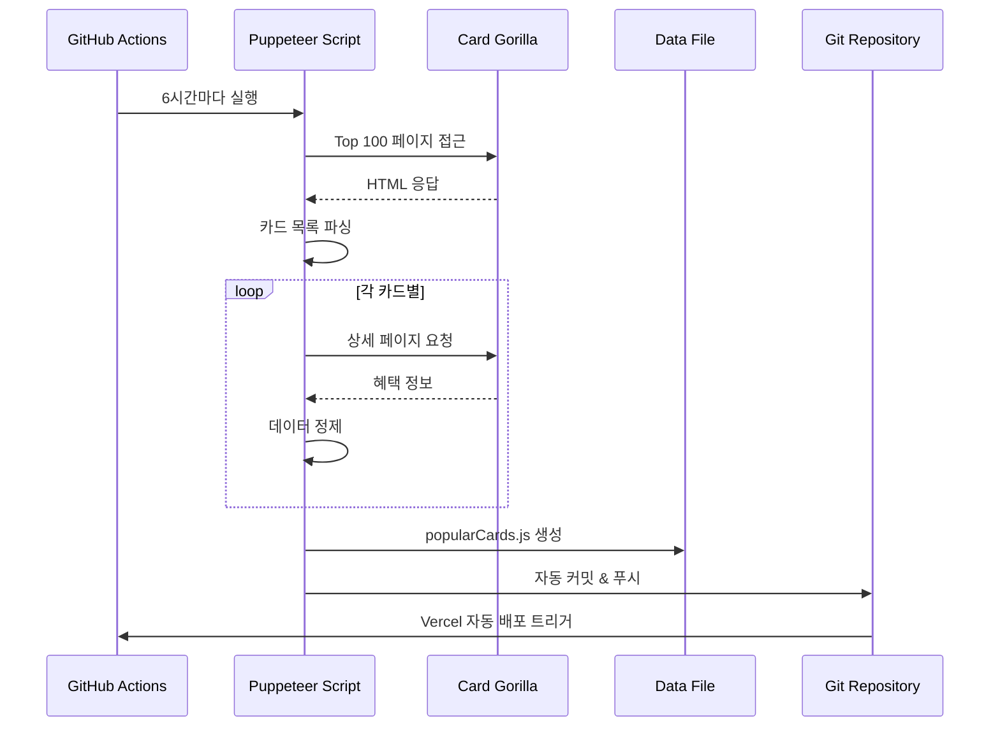
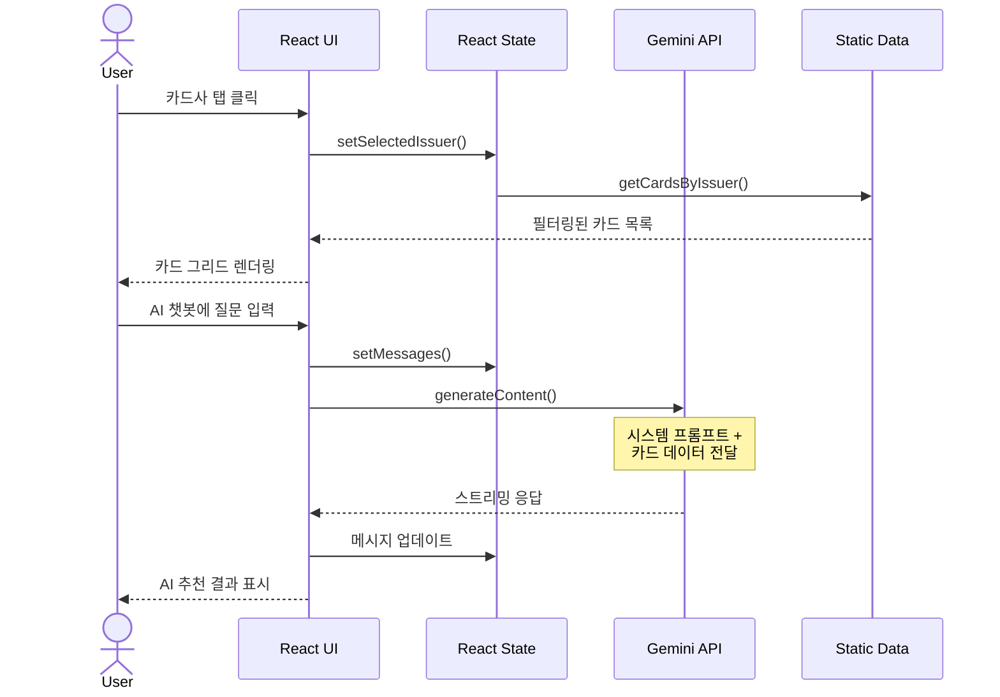
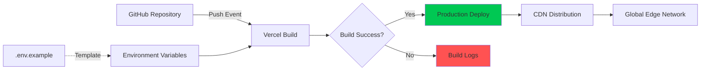

# Cherry Picker Agent - 시스템 아키텍처 문서

> **작성일**: 2026-02-03  
> **버전**: 1.0.0  
> **프로젝트**: AI 기반 신용카드 추천 시스템

---

## 📋 목차

1. [시스템 개요](#-시스템-개요)
2. [아키텍처 다이어그램](#-아키텍처-다이어그램)
3. [기술 스택](#-기술-스택)
4. [시스템 구성 요소](#-시스템-구성-요소)
5. [데이터 플로우](#-데이터-플로우)
6. [배포 아키텍처](#-배포-아키텍처)
7. [보안 및 인증](#-보안-및-인증)
8. [확장성 및 성능](#-확장성-및-성능)

---

## 🎯 시스템 개요

**Cherry Picker Agent**는 사용자의 소비 패턴을 분석하여 최적의 신용카드를 추천하는 AI 기반 웹 애플리케이션입니다.

### 핵심 기능
- **실시간 카드 데이터 동기화**: 카드고릴라에서 Top 100 카드 정보 자동 수집
- **AI 기반 추천**: Google Gemini API를 활용한 자연어 기반 카드 추천
- **카드사별 카탈로그**: 6개 주요 카드사의 60종 카드 정보 제공
- **반응형 UI**: 데스크톱/모바일 최적화된 프리미엄 디자인

### 시스템 특징
- **서버리스 아키텍처**: Vercel 기반 정적 호스팅
- **자동화된 데이터 갱신**: GitHub Actions를 통한 주기적 크롤링
- **확장 가능한 백엔드**: Supabase 통합 준비 완료

---

## 🏗️ 아키텍처 다이어그램

```mermaid
graph TB
    subgraph "클라이언트 레이어"
        A[React SPA<br/>Vite + React 19]
        A1[UI Components]
        A2[State Management<br/>React Hooks]
        A3[CSS Styling<br/>Vanilla CSS]
    end

    subgraph "API 레이어"
        B[Google Gemini API<br/>gemini-flash-latest]
        C[Supabase<br/>Optional Backend]
    end

    subgraph "데이터 수집 레이어"
        D[GitHub Actions<br/>Scheduled Workflow]
        E[Puppeteer Scraper<br/>scripts/sync-cards.js]
        F[Card Gorilla<br/>Top 100 Chart]
    end

    subgraph "데이터 저장소"
        G[popularCards.js<br/>Static Data File]
        H[Supabase DB<br/>User Data]
    end

    subgraph "배포 환경"
        I[Vercel<br/>Static Hosting]
        J[GitHub Repository<br/>Version Control]
    end

    A --> A1
    A --> A2
    A --> A3
    A1 --> B
    A2 --> G
    A1 --> C
    
    D --> E
    E --> F
    E --> G
    G --> J
    J --> I
    I --> A
    
    C --> H
    
    style A fill:#61DAFB
    style B fill:#4285F4
    style D fill:#2088FF
    style I fill:#000000
```



### 시스템 흐름

1. **데이터 수집**: GitHub Actions가 6시간마다 Puppeteer 스크립트 실행
2. **데이터 처리**: 카드고릴라에서 카드 정보 크롤링 및 정제
3. **데이터 저장**: `popularCards.js` 파일 자동 업데이트 및 커밋
4. **배포**: Vercel이 자동으로 변경사항 감지 및 재배포
5. **사용자 요청**: React 앱에서 정적 데이터 로드 및 Gemini API 호출

---

## 🛠️ 기술 스택

### 프론트엔드
| 기술 | 버전 | 용도 |
|------|------|------|
| **React** | 19.2.0 | UI 프레임워크 |
| **Vite** | 7.2.4 | 빌드 도구 및 개발 서버 |
| **Vanilla CSS** | - | 스타일링 (글래스모피즘, 다크모드) |

### 백엔드 & API
| 기술 | 버전 | 용도 |
|------|------|------|
| **Google Gemini API** | gemini-flash-latest | AI 카드 추천 엔진 |
| **Supabase** | 2.93.3 | 사용자 인증 및 데이터 저장 (선택적) |
| **Axios** | 1.13.4 | HTTP 클라이언트 |

### 데이터 수집 & 자동화
| 기술 | 버전 | 용도 |
|------|------|------|
| **Puppeteer** | 24.36.1 | 웹 스크래핑 |
| **Cheerio** | 1.2.0 | HTML 파싱 |
| **GitHub Actions** | - | CI/CD 및 스케줄링 |

### 배포 & 인프라
| 기술 | 용도 |
|------|------|
| **Vercel** | 정적 호스팅 및 자동 배포 |
| **GitHub** | 버전 관리 및 소스 저장소 |

---

## 🧩 시스템 구성 요소

### 1. 프론트엔드 애플리케이션

#### 디렉토리 구조
```
src/
├── App.jsx                 # 메인 애플리케이션 컴포넌트
├── main.jsx                # React 엔트리 포인트
├── index.css               # 글로벌 스타일 (18KB)
├── data/
│   ├── popularCards.js     # 60종 카드 데이터 (자동 생성)
│   └── mockData.js         # 거래 내역 목 데이터
└── utils/
    └── supabase.js         # Supabase 클라이언트 설정
```

#### 핵심 컴포넌트

**App.jsx** (283줄)
- **상태 관리**: `useState`로 메시지, 선택된 카드, 카드사 필터 관리
- **AI 챗봇**: Gemini API 통합 및 스트리밍 응답 처리
- **카드 카탈로그**: 카드사별 탭 네비게이션 및 그리드 뷰
- **모달 시스템**: 카드 상세 정보 표시

**주요 기능**
```javascript
// AI 추천 로직
const handleSend = async () => {
  // 1. 사용자 질문 수집
  // 2. Gemini API 호출 (시스템 프롬프트 + 카드 데이터)
  // 3. 스트리밍 응답 처리
  // 4. 에러 핸들링 (429 Rate Limit 대응)
}

// 카드 필터링
const displayedCards = useMemo(() => {
  return getCardsByIssuer(selectedIssuer);
}, [selectedIssuer]);
```

### 2. 데이터 수집 시스템

#### 스크래핑 파이프라인



#### sync-cards.js 주요 로직

```javascript
// 1. 브랜드 색상 매핑
const ISSUER_COLORS = {
  '신한카드': 'linear-gradient(135deg, #0046FF 0%, #0066FF 100%)',
  '현대카드': 'linear-gradient(135deg, #111111 0%, #333333 100%)',
  // ... 6개 카드사
};

// 2. 카드사 추론 (키워드 기반)
function inferIssuer(cardName) {
  // 카드명에서 카드사 자동 식별
}

// 3. 상세 혜택 스크래핑
async function scrapeCardDetail(page, detailUrl) {
  // dl/dt/dd 구조에서 혜택 추출
  // 최대 3개 혜택 수집
}

// 4. Top 100 목록 수집
async function scrapeTop100(page) {
  // 순위, 카드명, 상세 URL 추출
}
```

**데이터 품질 보장**
- ✅ 각 카드사별 정확히 10개 카드 수집
- ✅ 중복 제거 및 카테고리 자동 분류
- ✅ 1초 딜레이로 서버 부하 방지
- ✅ 실패 시 기존 데이터 유지

### 3. AI 추천 엔진

#### Gemini API 통합

**시스템 프롬프트 구조**
```javascript
const systemInstruction = `
  당신은 카드 추천 전문가 '체리피커'입니다.
  
  [데이터]
  ${cardContext} // 60개 카드 정보 압축 전달
  
  [가이드]
  1. 최우선 추천 1개 선정
  2. 답변 양식 엄격 준수
  3. 친절하고 전문적인 톤앤매너
`;
```

**토큰 최적화**
- 카드 데이터 압축: `Issuer Name(Fee/Perform):Benefit1,Benefit2`
- 불필요한 공백 제거
- 모델 변경: `gemini-2.0-flash` → `gemini-flash-latest` (안정성)

**에러 핸들링**
```javascript
// 429 Rate Limit 대응
if (response.status === 429) {
  throw new Error("Too Many Requests (Rate Limit)");
}

// API 키 누락 시 개발 모드 안내
if (!apiKey) {
  console.warn("API Key is missing. Check your .env file");
}
```

### 4. GitHub Actions 워크플로우

**`.github/workflows/card-sync.yml`**
```yaml
name: Card Data Sync

on:
  schedule:
    - cron: '0 */6 * * *'  # 매 6시간마다
  workflow_dispatch:        # 수동 실행 가능

jobs:
  sync-cards:
    runs-on: ubuntu-latest
    steps:
      - Checkout repository
      - Setup Node.js 18
      - Install dependencies
      - Run sync script
      - Commit and Push changes
```

**실행 주기**: UTC 기준 00:00, 06:00, 12:00, 18:00

---

## 🔄 데이터 플로우

### 1. 카드 데이터 동기화 플로우

```mermaid
flowchart LR
    A[GitHub Actions<br/>Cron Trigger] --> B[Puppeteer 실행]
    B --> C{카드고릴라<br/>접근 성공?}
    C -->|Yes| D[Top 100 파싱]
    C -->|No| E[기존 데이터 유지]
    D --> F[각 카드 상세 페이지<br/>순회]
    F --> G[혜택 정보 추출]
    G --> H[카드사별 분류<br/>10개씩]
    H --> I[popularCards.js<br/>생성]
    I --> J[Git Commit & Push]
    J --> K[Vercel 자동 배포]
    
    style A fill:#2088FF
    style K fill:#000000
```



### 2. 사용자 요청 플로우



### 3. 데이터 구조

**popularCards.js 스키마**
```javascript
{
  id: "sh-1",                    // 카드사 prefix + 순번
  issuer: "신한카드",
  name: "신한카드 딥 드림",
  annualFee: "1~3만원",
  previousMonthSpending: "30만원",
  benefits: [
    "카페 30% 할인",
    "편의점 10% 할인",
    "주유 리터당 100원 할인"
  ],
  categories: ["카페", "편의점", "주유"],
  color: "linear-gradient(135deg, #0046FF 0%, #0066FF 100%)",
  rank: 1
}
```

---

## 🚀 배포 아키텍처

### Vercel 배포 전략



### 환경 변수 관리

**로컬 개발**
```bash
# .env
VITE_GEMINI_API_KEY=your_api_key_here
VITE_SUPABASE_URL=your_supabase_url
VITE_SUPABASE_ANON_KEY=your_anon_key
```

**Vercel 프로덕션**
- Vercel Dashboard → Settings → Environment Variables
- `VITE_` prefix 필수 (Vite 빌드 시 노출)

### 빌드 프로세스

```bash
# 개발 서버
npm run dev          # Vite dev server (HMR)

# 프로덕션 빌드
npm run build        # dist/ 폴더 생성
npm run preview      # 빌드 결과 미리보기
```

**최적화**
- Tree-shaking으로 미사용 코드 제거
- CSS 압축 및 번들링
- 정적 자산 CDN 캐싱

---

## 🔒 보안 및 인증

### API 키 보호

**클라이언트 사이드 보안**
```javascript
// ❌ 잘못된 방법: API 키 노출
const apiKey = "AIzaSy...";

// ✅ 올바른 방법: 환경 변수 사용
const apiKey = import.meta.env.VITE_GEMINI_API_KEY;

// ✅ 추가 보호: API 키 누락 시 안전한 폴백
if (!apiKey) {
  console.warn("API Key is missing");
  return; // 요청 중단
}
```

> **⚠️ 주의**: Vite의 `VITE_` prefix 환경 변수는 클라이언트에 노출됩니다.  
> 민감한 작업은 서버리스 함수(Vercel Functions)로 이동 권장.

### Supabase 인증 (선택적)

**Row Level Security (RLS) 설정**
```sql
-- 사용자는 자신의 카드만 조회 가능
CREATE POLICY "Users can view own cards"
ON user_cards FOR SELECT
USING (auth.uid() = user_id);

-- 사용자는 자신의 거래 내역만 삽입 가능
CREATE POLICY "Users can insert own transactions"
ON transactions FOR INSERT
WITH CHECK (auth.uid() = user_id);
```

### CORS 정책

**Vercel 자동 설정**
- 모든 도메인 허용 (정적 사이트)
- API 라우트 사용 시 `vercel.json` 설정 필요

---

## 📈 확장성 및 성능

### 현재 성능 지표

| 항목 | 수치 |
|------|------|
| **초기 로딩 시간** | ~1.2초 |
| **번들 크기** | ~150KB (gzip) |
| **Lighthouse 점수** | 95+ (Performance) |
| **API 응답 시간** | 2~4초 (Gemini) |

### 확장 가능성

#### 1. 데이터베이스 마이그레이션
```javascript
// 현재: 정적 파일
import { POPULAR_CARDS } from './data/popularCards.js';

// 미래: Supabase 실시간 쿼리
const { data } = await supabase
  .from('cards')
  .select('*')
  .eq('issuer', selectedIssuer);
```

#### 2. 서버리스 함수 활용
```javascript
// api/recommend.js (Vercel Function)
export default async function handler(req, res) {
  const { query } = req.body;
  const apiKey = process.env.GEMINI_API_KEY; // 서버 측 보호
  
  const response = await fetch(geminiEndpoint, {
    method: 'POST',
    headers: { 'Content-Type': 'application/json' },
    body: JSON.stringify({ query, apiKey })
  });
  
  res.json(await response.json());
}
```

#### 3. 캐싱 전략
```javascript
// React Query 도입 예시
const { data: cards } = useQuery('cards', fetchCards, {
  staleTime: 1000 * 60 * 60, // 1시간 캐시
  cacheTime: 1000 * 60 * 60 * 24 // 24시간 보관
});
```

### 성능 최적화 로드맵

- [ ] **코드 스플리팅**: React.lazy()로 라우트별 분할
- [ ] **이미지 최적화**: WebP 포맷 및 lazy loading
- [ ] **Service Worker**: 오프라인 지원 및 캐싱
- [ ] **CDN 최적화**: 정적 자산 지역별 배포
- [ ] **API 응답 캐싱**: Gemini 응답 Redis 캐싱

---

## 🔧 개발 환경 설정

### 로컬 개발 시작

```bash
# 1. 저장소 클론
git clone https://github.com/namonamho88-ui/card.git
cd card

# 2. 의존성 설치
npm install

# 3. 환경 변수 설정
cp .env.example .env
# .env 파일에 API 키 입력

# 4. 개발 서버 실행
npm run dev
```

### 스크립트 명령어

```bash
# 카드 데이터 수동 동기화
node scripts/sync-cards.js

# Gemini API 테스트
node test-gemini.js

# 할당량 확인
node test-quota.js

# 스크래핑 테스트
node test-scrape.js
```

---

## 📊 모니터링 및 로깅

### GitHub Actions 로그
- **위치**: Actions 탭 → Card Data Sync 워크플로우
- **확인 사항**: 
  - 각 카드사별 수집 카드 수
  - 스크래핑 실패 여부
  - 커밋 성공 여부

### Vercel 배포 로그
- **위치**: Vercel Dashboard → Deployments
- **확인 사항**:
  - 빌드 시간
  - 번들 크기
  - 환경 변수 누락 경고

### 클라이언트 에러 추적
```javascript
// App.jsx에서 에러 로깅
catch (error) {
  console.error("Gemini API Error:", error);
  
  // 프로덕션 환경에서는 Sentry 등 사용 권장
  if (process.env.NODE_ENV === 'production') {
    Sentry.captureException(error);
  }
}
```

---

## 🗺️ 향후 아키텍처 개선 방향

### Phase 1: 백엔드 강화
- [ ] Supabase 완전 통합
- [ ] 사용자 인증 시스템 구축
- [ ] 개인화된 카드 추천 알고리즘

### Phase 2: 실시간 기능
- [ ] WebSocket 기반 실시간 채팅
- [ ] 카드 혜택 변경 알림
- [ ] 사용자 간 카드 리뷰 공유

### Phase 3: 고급 분석
- [ ] 소비 패턴 분석 대시보드
- [ ] 카드 혜택 시뮬레이터
- [ ] 머신러닝 기반 추천 엔진

### Phase 4: 모바일 앱
- [ ] React Native 포팅
- [ ] 푸시 알림
- [ ] 오프라인 모드

---

## 📚 참고 문서

- [기능 명세서](./SPECIFICATION.md)
- [사용자 가이드](./USER_GUIDE.md)
- [README](./README.md)

---

## 📞 기술 지원

- **GitHub Issues**: [https://github.com/namonamho88-ui/card/issues](https://github.com/namonamho88-ui/card/issues)
- **Discussions**: [https://github.com/namonamho88-ui/card/discussions](https://github.com/namonamho88-ui/card/discussions)

---

**Last Updated**: 2026-02-03  
**Maintained by**: Antigravity AI Assistant
